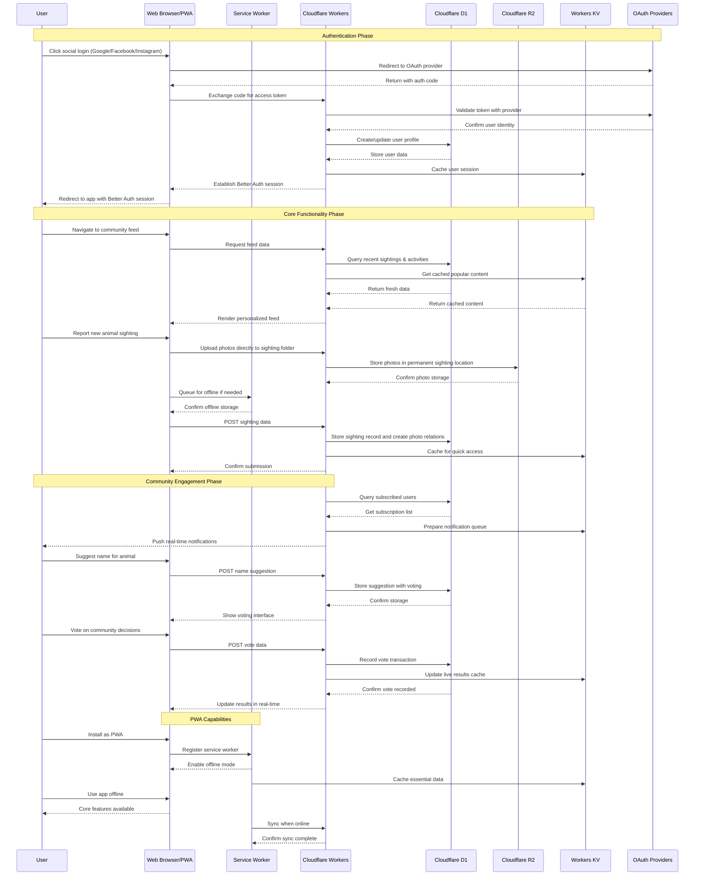
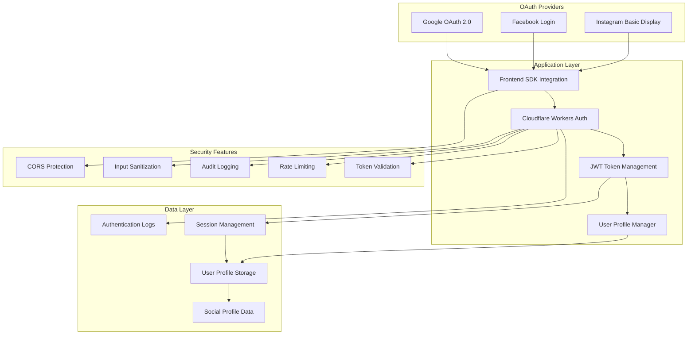
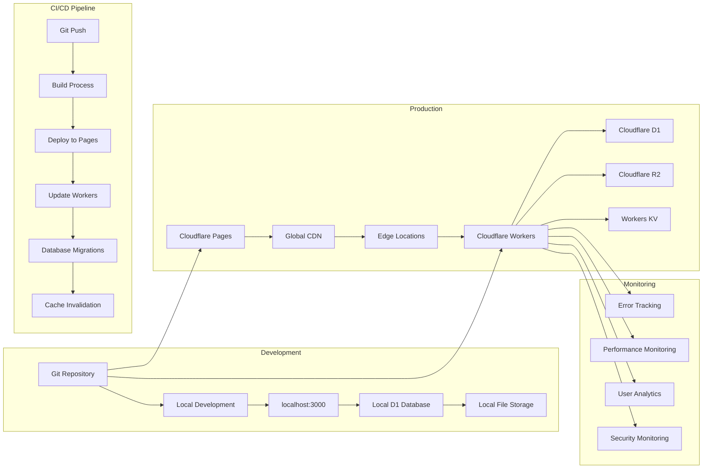
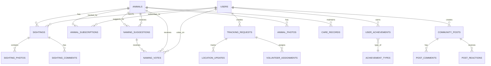
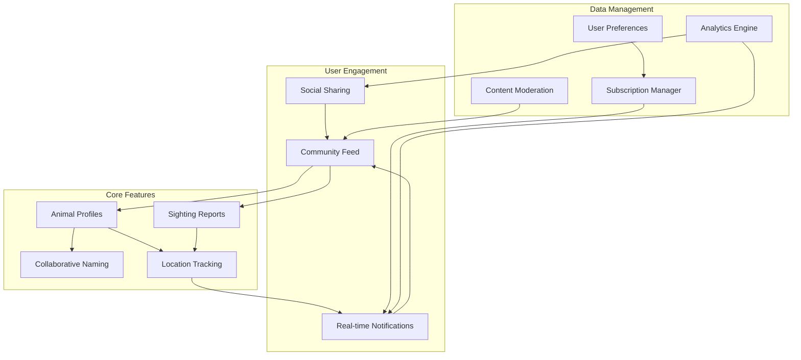
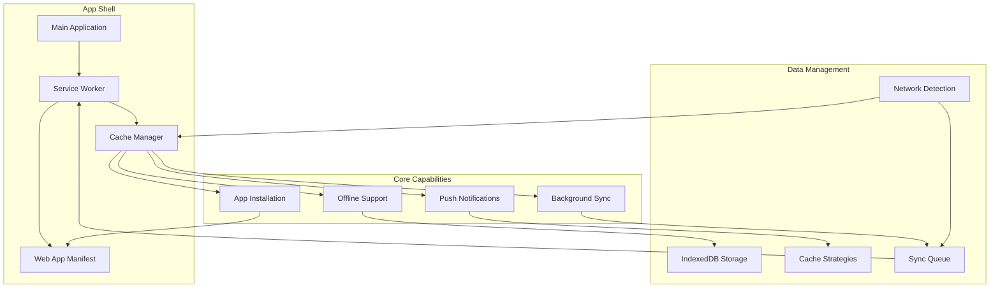

# Stray Tracker - System Architecture

## Overview

This document outlines the comprehensive architecture for the Stray Tracker application, a mobile-first Progressive Web App with web compatibility, designed as a community-driven platform for tracking and caring for stray animals. The system leverages modern web technologies and cloud infrastructure to provide a scalable, real-time solution for animal welfare tracking, prioritizing mobile experience while maintaining full desktop functionality.

## System Architecture

### High-Level Architecture Diagram

```mermaid
graph TB
    %% Client Layer
    subgraph "Client Layer"
        A[Web Browser/Mobile/PWA] --> B[TanStack Start App]
        B --> C[React 18 Components]
        C --> D[Tailwind CSS + shadcn/ui]
    end

    %% Framework Layer
    subgraph "Framework Layer"
        B --> E[TanStack Router]
        B --> F[TanStack Query (React Query)]
        F --> G[API State Management]
    end

    %% Service Layer
    subgraph "Service Layer"
        G --> H[Cloudflare Workers API]
        H --> I[Authentication Service]
        H --> J[File Upload Service]
        H --> K[Real-time Notifications]
        H --> L[Community Services]
    end

    %% Data Layer
    subgraph "Data Layer"
        I --> M[Cloudflare D1 Database]
        J --> N[Cloudflare R2 Storage]
        K --> O[Cloudflare Workers KV]
        L --> M
    end

    %% Infrastructure Layer
    subgraph "Infrastructure Layer"
        H --> P[Cloudflare Workers Runtime]
        P --> Q[Global CDN]
        Q --> R[Edge Locations]
    end

    %% External Integrations
    subgraph "External Integrations"
        M --> S[(Animal Welfare APIs)]
        N --> T[AWS S3 Compatible]
        O --> U[Redis Compatible]
        I --> V[OAuth Providers]
    end

    %% Styling
    classDef clientLayer fill:#e1f5fe,stroke:#01579b,stroke-width:2px
    classDef frameworkLayer fill:#f3e5f5,stroke:#4a148c,stroke-width:2px
    classDef serviceLayer fill:#e8f5e8,stroke:#1b5e20,stroke-width:2px
    classDef dataLayer fill:#fff3e0,stroke:#e65100,stroke-width:2px
    classDef infraLayer fill:#fce4ec,stroke:#880e4f,stroke-width:2px
    classDef externalLayer fill:#f1f8e9,stroke:#33691e,stroke-width:2px

    class A,B,C,D clientLayer
    class E,F,G frameworkLayer
    class H,I,J,K,L serviceLayer
    class M,N,O dataLayer
    class P,Q,R infraLayer
    class S,T,U,V externalLayer
```

### System Workflow



## Application Architecture

### Frontend Architecture

#### Component Structure

**Layout Components**

- Root layout with navigation and error boundaries
- PWA install prompt and update notifications
- Responsive design with mobile-first approach

**Feature Components**

- Animal cards with photo galleries and status tracking
- User profiles with social integration and activity history
- Sighting forms with location services and media upload (multi-step stepper UI with floating action buttons)
- Community feed with real-time updates and engagement features
- Stepper component system for complex multi-step workflows

**UI Components**

- Reusable buttons, inputs, modals, and form elements
- Search filters with advanced filtering options
- Voting interfaces for community decisions
- Interactive maps for location-based features
- Stepper components for multi-step form navigation
- Floating action buttons for enhanced mobile UX

**Utility Components**

- Loading states and skeleton screens
- Error handling and fallback interfaces
- SEO optimization with meta tags and structured data
- Offline indicators and sync status
- Stepper navigation system for multi-step workflows
- Form validation and error display components

**PWA Components**

- App install button and installation flow
- Service worker registration and updates
- Offline queue management and sync status
- Push notification subscription management

#### State Management

- **TanStack Query (React Query)**: Server state management and caching
- **Zustand**: Client state for UI preferences and temporary data
- **Local Storage**: Persistent user preferences and offline data

### Backend Architecture

#### API Layer

**RESTful Endpoints**

- CRUD operations for all core entities
- Real-time WebSocket connections for live updates
- Rate-limited endpoints with proper error handling
- File upload endpoints with temporary storage and cleanup:
  - `/api/upload-temp` - Generate signed URLs for temporary image uploads
  - `/api/cleanup-temp` - Manual cleanup of temporary files (admin/testing)

**Authentication Service**

- Better Auth framework integration with Google, Facebook, and Instagram (fully implemented)
- Better Auth session management with secure token handling
- Role-based access control (RBAC) with Better Auth's permission system

**File Management Service**

- Image and video upload to Cloudflare R2 with direct upload to permanent sighting folders
- CDN optimization with responsive image generation and WebP conversion
- File validation and malicious content scanning
- Direct upload system with database relation creation for sighting photos
- Automated cleanup of orphaned files with database comparison
- Session-based upload isolation for security

**Notification Service**

- Real-time push notifications via WebSockets
- Email digest system for community updates
- SMS alerts for urgent animal welfare notifications

**Community Services**

- Voting systems for collaborative naming and decisions
- Subscription management for location and animal tracking

#### Data Layer

**Database Schema (D1)**

- Optimized queries with proper indexing strategies
- Transaction support for data consistency
- JSON field support for flexible metadata storage

**Caching Strategy (KV)**

- Multi-level caching for improved performance
- Session management and user state persistence
- Real-time data synchronization across edge locations

**File Storage (R2)**

- Scalable object storage with global distribution
- Automatic image optimization and format conversion
- Access control and content moderation features

## Security Architecture

### Authentication & Authorization



### Security Measures

**Data Protection**

- TLS 1.3 encryption for all data in transit
- Sensitive data encryption at rest in D1
- File upload scanning for malicious content
- Input validation and SQL injection prevention

**Access Control**

- JWT-based authentication with secure refresh tokens
- Role-based permissions for different user types
- API rate limiting to prevent abuse
- CORS protection for cross-origin requests

**Audit & Monitoring**

- Comprehensive logging of authentication events
- Security event monitoring and alerting
- Failed authentication attempt tracking
- Data access pattern analysis

## Deployment Architecture

### Infrastructure Overview



### Deployment Strategy

**Development Environment**

- Local development server with hot reload
- Local D1 database for testing
- Local file storage for development assets

**Production Environment**

- Cloudflare Pages for static asset hosting
- Global CDN for low-latency content delivery
- Edge computing with Cloudflare Workers
- Serverless databases and storage solutions

**CI/CD Pipeline**

- Automated builds on git push
- Database migration management
- Cache invalidation strategies
- Rollback capabilities for failed deployments
- Scheduled cron jobs for automated maintenance (temporary file cleanup)

## Performance Architecture

### Performance Optimization

**Caching Strategy**

- **Edge Caching**: Static assets cached at Cloudflare edge locations
- **Application Caching**: KV store for frequently accessed data
- **Database Optimization**: Prepared statements and query optimization
- **Image Optimization**: Responsive images with WebP/AVIF formats

**Scalability Features**

- **Auto-scaling**: Workers scale automatically with demand
- **Global Distribution**: CDN ensures low latency worldwide
- **Serverless Design**: No infrastructure management overhead
- **Pay-per-use**: Cost optimization based on actual usage

**Performance Monitoring**

- Real user monitoring (RUM) for frontend performance
- API endpoint performance tracking
- Database query performance analysis
- Error tracking and performance regression detection

## Data Architecture

### Entity Relationship Model



### Data Models

#### User Management

```typescript
interface User {
  id: string
  email?: string
  displayName: string
  avatar?: string
  socialProfiles: {
    google?: { id: string; email: string }
    facebook?: { id: string; name: string }
    instagram?: { id: string; username: string }
  }
  preferences: {
    notifications: boolean
    locationRadius: number
    emailDigest: 'daily' | 'weekly' | 'never'
  }
  stats: {
    sightingsReported: number
    animalsHelped: number
  }
  role: 'member' | 'caretaker' | 'admin' | 'organization'
  joinedAt: Date
  lastActive: Date
}
```

#### Animal Tracking

```typescript
interface Animal {
  id: string
  name?: string
  species: 'cat' | 'dog' | 'other'
  breed?: string
  age?: 'puppy' | 'young' | 'adult' | 'senior'
  size: 'small' | 'medium' | 'large'
  colors: string[]
  markings?: string[]
  status: 'spotted' | 'being_cared_for' | 'adopted' | 'deceased'
  description?: string
  healthNotes?: string
  careRequirements?: string
  primaryLocation: {
    lat: number
    lng: number
    address?: string
    neighborhood?: string
  }
  sightingHistory: Sighting[]
  photos: MediaFile[]
  namingSuggestions: NamingSuggestion[]
  caretakerId?: string
  createdAt: Date
  updatedAt: Date
}
```

#### Community Features

```typescript
interface SightingSubscription {
  id: string
  userId: string
  animalId?: string
  location?: {
    lat: number
    lng: number
    radius: number // km
  }
  notificationPreferences: {
    immediate: boolean
    email: boolean
    push: boolean
    digest: 'daily' | 'weekly' | 'never'
  }
  isActive: boolean
  createdAt: Date
}

interface NamingSuggestion {
  id: string
  animalId: string
  userId: string
  name: string
  description?: string
  votes: number
  isSelected: boolean
  createdAt: Date
}

interface UserAchievement {
  id: string
  userId: string
  achievementTypeId: string
  earnedAt: Date
  metadata?: Record<string, any>
}
```

## Community Engagement Architecture

### Community Features Overview



### Community Components

**Collaborative Naming**

- Community-driven naming suggestions for unnamed animals
- Voting system for name selection
- Name history tracking and community polls
- Integration with animal profiles and status updates

**Multi-Step Form Workflows**

- Stepper-based navigation for complex form processes
- Floating action button controls for mobile optimization
- Progressive form validation with real-time feedback
- State persistence across form steps
- Responsive design for mobile and desktop experiences

**Subscription Services**

- Location-based subscriptions for local animal updates
- Animal-specific tracking for individual animal care
- Customizable notification preferences
- Digest management for email and push notifications

**Social Features**

- Cross-platform content sharing
- Community event organization and management
- Volunteer coordination for animal care tasks
- Partnership programs with local organizations

## Progressive Web App (PWA) Architecture

### PWA Capabilities



### PWA Features

**Offline Functionality**

- Service worker for offline asset caching
- IndexedDB for offline data storage
- Background sync for offline actions
- Network detection and reconnection handling

**App Installation**

- Web app manifest for installation
- App install prompts and flow management
- Update notifications for new versions
- Installation analytics and tracking

**Push Notifications**

- Real-time notification delivery
- Subscription management interface
- Notification categorization and preferences
- Engagement tracking and analytics

## Target Users and Success Metrics

### User Personas

**Primary Stakeholders**

1. **Community Members**: Local residents who want to help stray animals
2. **Animal Caretakers**: Individuals actively caring for specific animals
3. **Animal Welfare Organizations**: Shelters, vets, and rescue groups
4. **Local Businesses**: Pet stores, vets, and animal-related services

### Success Metrics

**User Engagement**

- Number of active users and community members
- User engagement rates (sightings reported, profiles created)
- Community growth and retention metrics
- Feature adoption and utilization rates

**Animal Welfare Impact**

- Number of animals tracked and successfully helped
- Positive outcomes measurement (adoptions, medical care, etc.)
- Community response times to animal needs
- Volunteer engagement and coordination effectiveness

**Platform Performance**

- System availability and reliability metrics
- Mobile adoption and PWA installation rates
- Feature utilization across different user groups
- Performance benchmarks and user experience scores

**Community Building**

- Social shares and community event participation
- Volunteer engagement levels and retention
- Partnership growth with local organizations
- User satisfaction and net promoter scores
