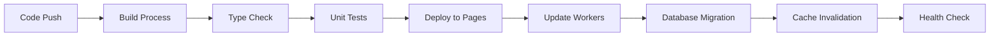

# Technical Documentation - Stray Tracker

## Technology Stack

### Core Technologies

**Frontend Framework**

- **React 18**: Modern React with concurrent features and improved performance
- **TanStack Start**: Full-stack React framework for seamless client-server integration
- **TypeScript**: Type-safe JavaScript for better development experience and fewer runtime errors

**Styling & UI**

- **Tailwind CSS**: Utility-first CSS framework for rapid UI development
- **shadcn/ui**: Modern component library built on Radix UI primitives
- **Lucide Icons**: Beautiful & consistent icon library

**State Management & Data Fetching**

- **TanStack Query (React Query)**: Powerful data synchronization for server state
- **Zustand**: Lightweight state management for client-side state (maintained by TanStack team)
- **@tanstack/react-form**: Type-safe, performant forms with integrated validation

#### TanStack Query Implementation Example

Here's how to implement API queries as custom hooks using TanStack Query:

```typescript
// src/hooks/useSightings.ts
import { useQuery } from '@tanstack/react-query'
import { getSightings } from '~/routes/api/sightings'

// Custom hook for fetching all sightings
export function useSightings() {
  return useQuery({
    queryKey: ['sightings'],
    queryFn: () => getSightings(),
    staleTime: 5 * 60 * 1000, // 5 minutes
  })
}
```

Usage in a React component with comprehensive error and loading handling:

```tsx
// In a component
function SightingList() {
  const {
    data: sightings,
    isLoading,
    error,
    isError,
    refetch,
    isFetching,
  } = useSightings()

  // Loading state with skeleton
  if (isLoading) {
    return (
      <div className="space-y-4">
        {[...Array(3)].map((_, i) => (
          <div key={i} className="animate-pulse">
            <div className="h-4 bg-gray-200 rounded w-3/4 mb-2"></div>
            <div className="h-3 bg-gray-200 rounded w-1/2"></div>
          </div>
        ))}
      </div>
    )
  }

  // Error state with retry functionality
  if (isError) {
    return (
      <div className="text-center p-4">
        <div className="text-red-600 mb-2">
          Failed to load sightings: {error?.message || 'Unknown error'}
        </div>
        <button
          onClick={() => refetch()}
          disabled={isFetching}
          className="px-4 py-2 bg-blue-500 text-white rounded hover:bg-blue-600 disabled:opacity-50"
        >
          {isFetching ? 'Retrying...' : 'Try Again'}
        </button>
      </div>
    )
  }

  return (
    <div className="relative">
      {isFetching && !isLoading && (
        <div className="absolute top-0 right-0 text-sm text-gray-500">
          Refreshing...
        </div>
      )}

      <div className="space-y-2">
        {sightings?.map(sighting => (
          <div key={sighting.id} className="p-4 border rounded">
            <div className="font-medium">
              {sighting.stray?.species} sighted at {sighting.location}
            </div>
            {sighting.description && (
              <div className="text-sm text-gray-600 mt-1">
                {sighting.description}
              </div>
            )}
          </div>
        ))}

        {sightings?.length === 0 && (
          <div className="text-center text-gray-500 py-8">
            No sightings reported yet.
          </div>
        )}
      </div>
    </div>
  )
}
```

#### TanStack Query Mutation Example

Here's how to implement API mutations using TanStack Query for creating new sightings:

```typescript
// src/hooks/useCreateSighting.ts
import { useMutation, useQueryClient } from '@tanstack/react-query'
import { createSighting } from '~/routes/api/sightings'

// Custom hook for creating a new sighting
export function useCreateSighting() {
  const queryClient = useQueryClient()

  return useMutation({
    mutationFn: (data: {
      latitude: number
      longitude: number
      description?: string
      images?: string[]
      strayId?: number
      species?: string
      animalSize?: string
    }) => createSighting(data),
    onSuccess: () => {
      // Invalidate and refetch sightings data
      queryClient.invalidateQueries({ queryKey: ['sightings'] })
    },
  })
}
```

Usage in a React component with comprehensive error and loading handling:

```tsx
// In a component
function ReportSightingForm() {
  const [successMessage, setSuccessMessage] = useState('')
  const createSighting = useCreateSighting()

  const handleSubmit = async (formData: SightingFormData) => {
    setSuccessMessage('')

    try {
      await createSighting.mutateAsync({
        latitude: formData.location.lat,
        longitude: formData.location.lng,
        description: formData.description,
        images: formData.images,
        species: formData.species,
        animalSize: formData.size,
      })

      // Handle success
      setSuccessMessage('Sighting reported successfully!')
      // Reset form or redirect as needed
    } catch (error) {
      // Error is automatically handled by the mutation
      console.error('Failed to report sighting:', error)
    }
  }

  return (
    <div className="max-w-md mx-auto">
      {successMessage && (
        <div className="mb-4 p-3 bg-green-100 border border-green-400 text-green-700 rounded">
          {successMessage}
        </div>
      )}

      {createSighting.isError && (
        <div className="mb-4 p-3 bg-red-100 border border-red-400 text-red-700 rounded">
          <strong>Error:</strong>{' '}
          {createSighting.error?.message || 'Failed to report sighting'}
          <button
            onClick={() => createSighting.reset()}
            className="ml-2 text-sm underline hover:no-underline"
          >
            Dismiss
          </button>
        </div>
      )}

      <form onSubmit={handleSubmit} className="space-y-4">
        {/* Form fields would go here */}
        <div>
          <label className="block text-sm font-medium mb-1">Description</label>
          <textarea
            name="description"
            className="w-full p-2 border rounded"
            disabled={createSighting.isPending}
          />
        </div>

        <button
          type="submit"
          disabled={createSighting.isPending}
          className="w-full px-4 py-2 bg-blue-500 text-white rounded hover:bg-blue-600 disabled:opacity-50 disabled:cursor-not-allowed"
        >
          {createSighting.isPending ? (
            <div className="flex items-center justify-center">
              <div className="animate-spin rounded-full h-4 w-4 border-b-2 border-white mr-2"></div>
              Reporting Sighting...
            </div>
          ) : (
            'Report Sighting'
          )}
        </button>
      </form>

      {createSighting.isSuccess && !successMessage && (
        <div className="mt-4 p-3 bg-green-100 border border-green-400 text-green-700 rounded">
          Sighting has been reported successfully!
        </div>
      )}
    </div>
  )
}
```

**Routing & Navigation**

- **TanStack Router**: Type-safe routing with file-based route generation
- **Progressive Web App (PWA)**: Installable web app with offline capabilities

**Data Display & Tables**

- **@tanstack/react-table**: Headless UI for building powerful tables and data grids
- **@tanstack/react-virtual**: High-performance virtualization for large datasets

### Backend & Infrastructure

**Serverless Platform**

- **Cloudflare Workers**: Edge computing platform for serverless functions
- **Cloudflare Pages**: Static site hosting with global CDN
- **Cloudflare D1**: Serverless database built on SQLite

**Storage & Media**

- **Cloudflare R2**: Object storage for images, videos, and files
- **Cloudflare KV**: Key-value storage for caching and session management

**Authentication & Security**

- **Better Auth**: Comprehensive authentication framework with multiple providers and session management
- **Social OAuth**: Google, Facebook, Instagram, and other social providers
- **Multi-Device Sessions**: Secure session management across devices
- **Cloudflare Workers Integration**: Optimized for serverless environment

## Development Environment

### Prerequisites

**Required Software**

- **Node.js 18+**: JavaScript runtime environment
- **pnpm**: Fast, disk space efficient package manager
- **Git**: Version control system
- **VS Code**: Recommended IDE with recommended extensions

**Cloudflare Account**

- Cloudflare account with Workers & Pages enabled
- Wrangler CLI for local development and deployment

### Local Development Setup

```bash
# Clone the repository
git clone <repository-url>
cd stray-tracker

# Install dependencies
pnpm install

# Set up environment variables
cp .env.example .env.local

# Start local development server
pnpm dev

# Start Cloudflare Workers locally
pnpm wrangler dev
```

### Environment Configuration

```env
# Local Development
VITE_API_URL=http://localhost:8787
VITE_APP_URL=http://localhost:3000

# Cloudflare Configuration
CF_API_TOKEN=your_api_token
CF_ACCOUNT_ID=your_account_id

# OAuth Configuration
GOOGLE_CLIENT_ID=your_google_client_id
FACEBOOK_APP_ID=your_facebook_app_id
INSTAGRAM_CLIENT_ID=your_instagram_client_id

# Database
DATABASE_URL=your_database_url

# Storage
R2_ACCESS_KEY_ID=your_r2_access_key
R2_SECRET_ACCESS_KEY=your_r2_secret_key
```

## Project Structure

```
stray-tracker/
├── docs/                          # Documentation
│   ├── architecture.md           # System architecture
│   ├── product_requirement_docs.md # PRD
│   └── technical.md              # Technical documentation
├── src/                          # Source code
│   ├── components/               # React components
│   │   ├── ui/                   # Reusable UI components
│   │   └── ...                   # Feature components
│   ├── routes/                   # File-based routing
│   │   ├── api/                  # API routes
│   │   └── ...                   # Page routes
│   ├── lib/                      # Utility libraries
│   ├── styles/                   # Global styles
│   └── utils/                    # Helper functions
├── public/                       # Static assets
├── db/                          # Database files
├── tasks/                       # Project tasks and context
├── package.json                 # Dependencies and scripts
├── vite.config.ts              # Vite configuration
├── tailwind.config.mjs         # Tailwind CSS config
├── tsconfig.json               # TypeScript configuration
└── wrangler.json               # Cloudflare Workers config
```

## Key Technical Decisions

### Framework Selection

**TanStack Start over Next.js**

- **Edge-first deployment**: Native Cloudflare Workers integration
- **File-based routing**: Automatic route generation and type safety
- **Smaller bundle size**: Optimized for edge computing
- **Better performance**: Reduced cold starts and faster response times

**Tailwind CSS + shadcn/ui**

- **Consistent design system**: Pre-built components with customizable theming
- **Accessibility**: Built-in ARIA support and keyboard navigation
- **Developer experience**: Utility-first approach with excellent TypeScript support
- **Bundle optimization**: Tree-shakable components and minimal runtime overhead

### Architecture Patterns

**Serverless-First Design**

- **Scalability**: Automatic scaling based on demand
- **Cost efficiency**: Pay-per-use pricing model
- **Global performance**: Edge locations worldwide
- **Reduced complexity**: No server provisioning or management

**Mobile-first Progressive Web App (PWA)**

- **Mobile-first design**: Optimized for mobile devices with web compatibility
- **Cross-platform compatibility**: Works on mobile, tablet, and desktop
- **Offline functionality**: Core features work without internet connection
- **App-like experience**: Native installation and push notifications
- **Improved engagement**: Higher user retention and interaction rates

### State Management Strategy

**TanStack-Centric State Management**

- **Server State**: TanStack Query for API data with caching and synchronization
- **Client State**: Zustand for UI preferences and temporary data (maintained by TanStack team)
- **Local State**: React state for component-specific data
- **URL State**: TanStack Router for navigation and shareable URLs
- **Data Tables**: @tanstack/react-table for powerful data grid functionality

## Development Workflow

### Code Organization

**Component Architecture**

- **Atomic Design**: Components organized by complexity and reusability
- **Feature-based structure**: Related components grouped by feature
- **Shared components**: Common UI elements in dedicated directories
- **Type safety**: Full TypeScript coverage with strict type checking

**API Design**

- **RESTful endpoints**: Consistent API design patterns
- **Error handling**: Comprehensive error responses and user feedback
- **Rate limiting**: Protection against abuse and spam
- **Documentation**: OpenAPI/Swagger documentation for all endpoints

### Database Design

**Schema Strategy**

- **Normalized design**: Efficient data storage and query performance
- **JSON fields**: Flexible metadata storage using text columns with JSON mode for extensible data models
- **Indexing strategy**: Optimized queries for common access patterns
- **Migration system**: Version-controlled database schema changes

### File Management

**Media Handling**

- **Image optimization**: Automatic resizing and format conversion
- **Video processing**: Compression and format optimization
- **File validation**: Security scanning and type verification
- **CDN delivery**: Global content distribution for fast loading

**Sighting Image Upload Strategy**

The application implements a streamlined image upload workflow for sighting reports that prioritizes data integrity and efficient storage management, utilizing the Cloudflare R2 bucket `stray-tracker-animal-photos`:

1. **Direct Upload Phase**: When users select images while filling out the sighting form, files are immediately uploaded directly to the permanent sighting folder in the `stray-tracker-animal-photos` Cloudflare R2 bucket. This allows the upload process to happen asynchronously in the background while maintaining form responsiveness.

2. **Background Processing**: While uploads proceed in the background, users can continue filling out other form fields without interruption. The UI provides progress indicators and maintains form responsiveness.

3. **Database Relation Creation**: Upon successful form submission, the server-side function (`createSighting`) creates the database relationships between the sighting record and the uploaded sighting photos. This establishes the permanent link between the sighting data and its associated media files.

4. **Orphaned File Cleanup**: A scheduled cleanup process compares the database records of sighting photos against the files stored in the R2 bucket folders. Any files that exist in the sighting folders but lack corresponding database entries are identified as orphaned and removed to prevent storage accumulation.

5. **Isolation Strategy**: Each upload session is uniquely identified using a combination of timestamp and a random request hash generated by the frontend. This ensures that multiple users uploading simultaneously cannot accidentally access or mix each other's files within the shared bucket.

This strategy provides:

- **Improved UX**: Users don't need to wait for uploads to complete before proceeding
- **Data Integrity**: Direct upload to final location with database-driven cleanup ensures consistency
- **Performance**: Background processing minimizes perceived latency
- **Storage Efficiency**: Automated cleanup of orphaned files prevents unnecessary storage costs
- **Security**: Isolated upload sessions prevent cross-user contamination
- **Cost Efficiency**: Single bucket organization with targeted cleanup reduces complexity and storage costs

## Deployment Strategy

### Environment Management

**Multi-Environment Setup**

- **Development**: Local development with hot reload
- **Staging**: Pre-production environment for testing
- **Production**: Live environment with monitoring and analytics

**Deployment Pipeline**



### Monitoring & Analytics

**Performance Monitoring**

- **Real User Monitoring (RUM)**: Frontend performance tracking
- **API Performance**: Endpoint response times and error rates
- **Database Metrics**: Query performance and connection pooling
- **Error Tracking**: Comprehensive error logging and alerting

**User Analytics**

- **Core Metrics**: User engagement, retention, and conversion
- **Feature Usage**: Track adoption of new features
- **Performance Insights**: User experience and technical metrics
- **Custom Events**: Business-specific tracking and analysis

## Security Considerations

### Authentication & Authorization

**Better Auth Framework**

- **Unified Authentication**: Single framework handling OAuth, email/password, and social providers
- **Multi-Provider Support**: Google, Facebook, Instagram, and extensible provider system
- **Session Management**: Secure, scalable session handling with device management
- **Cloudflare Workers Optimized**: Designed for serverless environments with edge computing
- **Role-Based Access Control**: Granular permission system with user roles and permissions
- **Security Features**: Built-in CSRF protection, rate limiting, and secure token handling

**Data Protection**

- **Encryption**: TLS 1.3 for data in transit
- **Data Sanitization**: Input validation and SQL injection prevention
- **File Security**: Malicious content scanning for uploads
- **Privacy Compliance**: GDPR and data protection standards

### Security Best Practices

**Application Security**

- **Content Security Policy (CSP)**: XSS protection and content restrictions
- **Rate Limiting**: API abuse prevention and DDoS protection
- **Input Validation**: Comprehensive validation on all user inputs
- **Error Handling**: Secure error messages without information leakage

**Infrastructure Security**

- **Edge Security**: Cloudflare's global security and performance features
- **DDoS Protection**: Automatic mitigation of volumetric attacks
- **Web Application Firewall**: Protection against common vulnerabilities
- **Access Logging**: Comprehensive audit trails for security events

## Performance Optimization

### Frontend Performance

**Bundle Optimization**

- **Code Splitting**: Automatic route-based code splitting
- **Tree Shaking**: Remove unused code from bundles
- **Image Optimization**: Responsive images with modern formats
- **Caching Strategy**: Aggressive caching with cache invalidation

**Runtime Performance**

- **Lazy Loading**: Components and routes loaded on demand
- **@tanstack/react-virtual**: Efficient virtualization for large lists and grids
- **Service Worker**: Offline support and background sync
- **Memory Management**: Proper cleanup and garbage collection

### Backend Performance

**Edge Computing Benefits**

- **Global Latency**: Requests served from nearest edge location
- **Cold Start Optimization**: Minimal startup time for serverless functions
- **Auto-scaling**: Automatic resource allocation based on demand
- **Database Optimization**: Efficient queries with proper indexing

**Caching Strategy**

- **Multi-level Caching**: Browser, edge, and application-level caching
- **Cache Invalidation**: Smart invalidation based on data changes
- **CDN Optimization**: Static asset optimization and compression
- **Database Query Caching**: Frequently accessed data caching

## API Design

### RESTful API Structure

**Endpoint Organization**

```
API Routes:
├── /api/auth          # Authentication endpoints
├── /api/users         # User management
├── /api/animals       # Animal profiles and management
├── /api/sightings     # Animal sighting reports
├── /api/subscriptions # User subscriptions
├── /api/naming        # Collaborative naming
├── /api/community     # Community features
├── /api/notifications # Push notifications
└── /api/admin         # Administrative functions
```

**API Response Format**

```typescript
interface APIResponse<T> {
  data: T
  message?: string
  errors?: string[]
  meta?: {
    pagination?: {
      page: number
      limit: number
      total: number
      totalPages: number
    }
    timestamp: string
    requestId: string
  }
}
```

### Error Handling

**Error Response Structure**

```typescript
interface ErrorResponse {
  error: {
    code: string
    message: string
    details?: Record<string, any>
    requestId: string
    timestamp: string
  }
}
```

**Common HTTP Status Codes**

- `200`: Success
- `201`: Created
- `400`: Bad Request
- `401`: Unauthorized
- `403`: Forbidden
- `404`: Not Found
- `429`: Too Many Requests
- `500`: Internal Server Error

## External API Integrations

### Breed & Color API Services

**Service Architecture**

Stray Tracker integrates with third-party APIs to provide comprehensive breed and color data for cats and dogs. The system uses an abstraction layer for easy API switching and future extensibility.

**Breed APIs**

- **The Cat API** (`https://thecatapi.com/`): Free REST API providing cat breed information with images and characteristics
- **The Dog API** (`https://thedogapi.com/`): Free REST API providing dog breed list with images

**Implementation Pattern**

```typescript
interface BreedService {
  getBreeds(species: 'cat' | 'dog'): Promise<Breed[]>
  getBreed(id: string): Promise<Breed | null>
}

interface Breed {
  id: string
  name: string
  species: 'cat' | 'dog'
}
```

**Color Data Management**

Since breed APIs don't provide color information, the system uses predefined color options managed through a static service:

```typescript
interface ColorService {
  getColors(): Promise<Color[]>
}

interface Color {
  id: string
  name: string
  hexCode?: string
}
```

**API Endpoints**

- `GET /api/breeds?species=cat|dog` - Returns breed data for selected species
- `GET /api/colors` - Returns available color options for animal identification

**Error Handling & Fallbacks**

- Graceful degradation if external APIs are unavailable
- Client-side caching to reduce API calls
- Fallback to basic options if API requests fail
- Rate limiting and retry logic for API reliability

## Testing Strategy

### Testing Levels

**Unit Tests**

- Component testing with Vitest and React Testing Library
- Utility function testing with comprehensive coverage
- API endpoint testing with mock data
- Database operation testing with test fixtures

**Integration Tests**

- API integration with database
- Authentication flow testing
- File upload and processing
- Real-time notification testing

**End-to-End Tests**

- Critical user journey testing
- PWA functionality testing
- Cross-browser compatibility
- Mobile responsiveness testing

### Testing Tools

**Development Testing**

- **Vitest**: Fast unit testing framework
- **React Testing Library**: Component testing utilities
- **Playwright**: End-to-end testing
- **MSW**: API mocking for testing

**Performance Testing**

- **Lighthouse**: Performance and accessibility auditing
- **WebPageTest**: Real-world performance testing
- **Chrome DevTools**: Runtime performance analysis

## Future Technical Considerations

### Scalability Planning

**Horizontal Scaling**

- **Stateless Architecture**: Easy replication across edge locations
- **Database Sharding**: Distribution of data across multiple instances
- **CDN Optimization**: Global content distribution improvements
- **Caching Enhancements**: Advanced caching strategies

### Feature Expansion

**Mobile App Development**

- **React Native**: Cross-platform mobile application
- **Capacitor**: Web-to-native wrapper for mobile deployment
- **Native Features**: Camera, GPS, and push notification integration

### Technology Evolution

**TanStack Ecosystem Evolution**

- **React 19**: Concurrent features and improved performance
- **TanStack Query**: Enhanced caching and synchronization
- **TanStack Router**: Advanced routing features and performance improvements
- **TanStack Table**: Next-generation data table capabilities
- **Cloudflare Workers**: New runtime features and capabilities
- **PWA Standards**: Latest web app capabilities and APIs

**TanStack Integration Benefits**

- **Unified Ecosystem**: All TanStack tools share consistent APIs and patterns
- **Type Safety**: Full TypeScript support across all TanStack packages
- **Performance**: Optimized for modern React and edge computing
- **Developer Experience**: Excellent documentation and community support

This technical documentation serves as a comprehensive guide for developers working on the Stray Tracker platform, ensuring consistent implementation and maintenance of the system according to the defined architecture and requirements.
